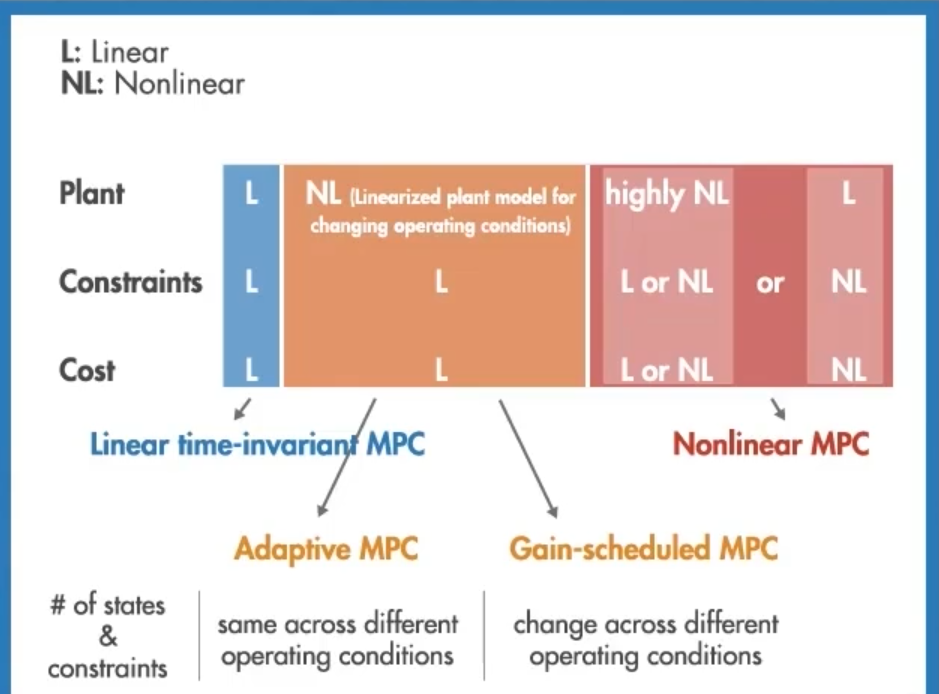

MPC模型预测控制

=

[toc]

# [MATLAB中国【Model Predictive Control】](https://space.bilibili.com/1768836923/search/video?keyword=mpc)

## 1. 特点

[参考视频1](https://www.bilibili.com/video/BV16U4y1c7EG?spm_id_from=333.999.0.0&vd_source=be5bd51fafff7d21180e251563899e5e)
[参考视频2](https://www.bilibili.com/video/BV1Qu411Z7DQ/?spm_id_from=333.788.recommend_more_video.-1&vd_source=be5bd51fafff7d21180e251563899e5e)

### 1.1. 优点

1. 可以处理MIMO，而PID只能处理SISO，虽然可以使用多个PID控制多个变量，但当变量之间存在耦合时，PID参数的调节会很困难；
2. 可以处理约束条件，由于模型预测控制是通过构建优化问题来求解控制器的动作的，所以可以非常自然的将这些约束建立在优化问题中以此来保证这些约束的满足。；
3. 使用了未来的预测信息。

### 1.2. 缺点

要求强大的计算力，因为在每一个时间步都需要求解优化问题。、

## 2. 参数设置

[参考视频](https://www.bilibili.com/video/BV1b44y1v7Xt/?spm_id_from=333.788.recommend_more_video.-1&vd_source=be5bd51fafff7d21180e251563899e5e)

采样时间：设置为开环系统响应上升时间Tr的1/20~1/10
$$\frac{Tr}{20} \leqslant Ts \leqslant \frac{Tr}{10}$$
预测区间：20～30个时间步
控制区间：预测区间的10%～20%，并且至少有2～3个时间步
约束条件：约束分为硬约束和软约束，硬约束不可违背，软约束可以违背。不建议对输入和输出都进行硬约束，因为两者可能冲突以致无法求解优化问题。建议将输出设为软约束，并避免对输入和输入变化率都有硬约束
权重：取决于实际情况

## 3. 自适应MPC，增益调度MPC，非线性MPC

[参考视频](https://www.bilibili.com/video/BV1ZL411g7Ya/?spm_id_from=333.788.recommend_more_video.-1&vd_source=be5bd51fafff7d21180e251563899e5e)

适用于处理非线性系统，其中自适应MPC和增益调度MPC的本质是将系统线性化

### 3.1. 自适应MPC(Adaptive MPC)

处理非线性系统时，在每个工作点附近对系统作线性化，得到一个新的线性模型，使用的前提是优化问题的结构在每个工作点不变，即在约束范围内，状态数量和约束数量不变。

### 3.2. 增益调度MPC(Gain-scheduled MPC)

优化问题的结构改变，可使用增益调度MPC。
离线线性化：在感兴趣工作点对系统进行线性化，并为每个感兴趣工作点设计一个线性MPC，每个线性MPC彼此独立，并且具有不同数量的状态和约束。
由于需要储存多个MPC控制器，因此消耗的内存比自适应MPC多。

### 3.3. 非线性MPC

无法很好的将非线性系统线性化的情况下使用非线性MPC。
控制会更加准确，求解会更加困难。

### 3.4. 总结

## 4. 加快MPC运行速度的方法

[参考视频](https://www.bilibili.com/video/BV1Ar4y1y7Tp/?spm_id_from=333.788.recommend_more_video.-1&vd_source=be5bd51fafff7d21180e251563899e5e)

1. 模型降阶(Model Order Reduction)
2. 舍弃对系统动力学没有贡献的状态量
3. 缩短预测区间和控制区间
4. 减少约束的数量
5. 使用更低的数据精度
6. 使用显式MPC(Explicit MPC):通过离线预计算最优解，来大大减少运行时间
7. 使用次优解

## 5. 示例

[参考视频1](https://www.bilibili.com/video/BV1xP4y1s7pJ?spm_id_from=333.999.0.0&vd_source=be5bd51fafff7d21180e251563899e5e)
[参考视频2](https://www.bilibili.com/video/BV1Wr4y1k76z?spm_id_from=333.999.0.0)

使用自动驾驶汽车示例来演示控制器的设计。